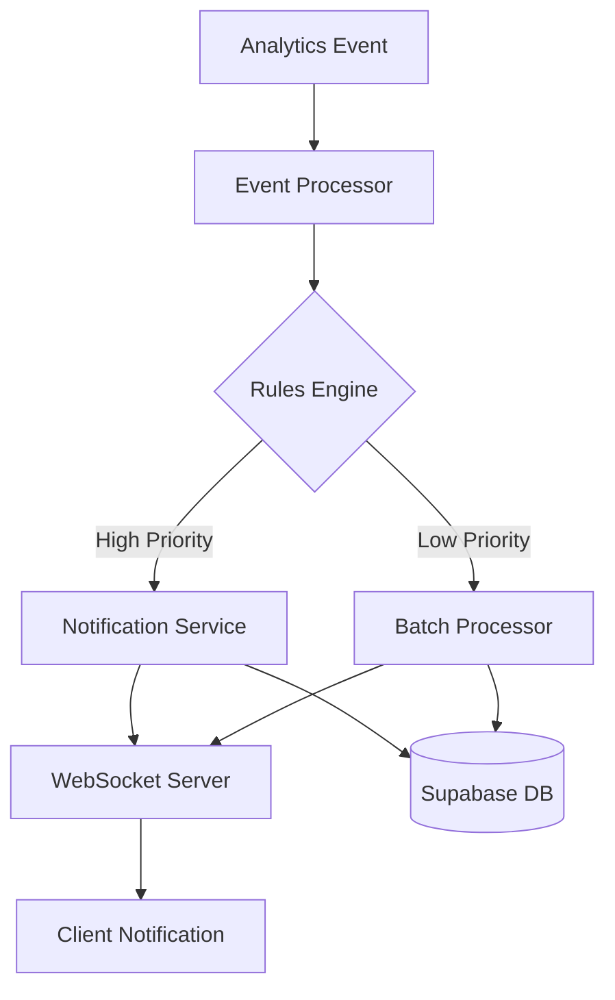

# Real-time Notification System

This document provides an overview of the real-time notification system implemented in VowSwap. The system allows administrators and relevant stakeholders to receive notifications about important platform activities as they happen.

## Architecture Overview

The notification system consists of several components:



1. **Analytics Events**: Events generated by user actions on the platform
2. **Event Processor**: Processes events and determines if they should trigger notifications
3. **Rules Engine**: Applies rules to determine if an event is significant
4. **Notification Service**: Creates and manages notifications
5. **WebSocket Server**: Delivers notifications in real-time
6. **Client Components**: Display notifications to users

## Database Schema

The notification system uses two main tables:

### Notifications Table

```sql
CREATE TABLE notifications (
  id UUID PRIMARY KEY DEFAULT uuid_generate_v4(),
  type VARCHAR(50) NOT NULL,
  priority VARCHAR(20) NOT NULL,
  title TEXT NOT NULL,
  message TEXT NOT NULL,
  metadata JSONB,
  is_read BOOLEAN DEFAULT false,
  created_at TIMESTAMP WITH TIME ZONE DEFAULT now(),
  user_id UUID REFERENCES auth.users(id),
  event_id UUID REFERENCES analytics_events(id)
);
```

### Notification Preferences Table

```sql
CREATE TABLE notification_preferences (
  id UUID PRIMARY KEY DEFAULT uuid_generate_v4(),
  user_id UUID NOT NULL REFERENCES auth.users(id),
  notification_type VARCHAR(50) NOT NULL,
  enabled BOOLEAN DEFAULT true,
  email_enabled BOOLEAN DEFAULT false,
  created_at TIMESTAMP WITH TIME ZONE DEFAULT now(),
  updated_at TIMESTAMP WITH TIME ZONE DEFAULT now(),
  UNIQUE(user_id, notification_type)
);
```

## Notification Types

The system supports the following notification types:

| Type | Description | Priority |
|------|-------------|----------|
| `SEARCH_SPIKE` | Unusual increase in specific search terms | High |
| `FILTER_TREND` | Popular filter combinations emerging | Medium |
| `HIGH_VALUE_LISTING` | Listings above certain price threshold | High |
| `LISTING_POPULARITY` | Listings receiving many views | Medium |
| `SYSTEM_ALERT` | System performance or error alerts | Critical |
| `USER_ACTIVITY` | Significant user activity | Low |
| `ABUSE_DETECTION` | Potential system abuse detection | Critical |

## Rules Engine

The rules engine determines when to create notifications based on predefined rules. Each rule has:

1. A unique identifier
2. A condition function that evaluates if an event should trigger a notification
3. A notification creation function that formats the notification
4. An enabled/disabled flag

Example rule:

```typescript
{
  id: 'search-spike',
  name: 'Search Spike Detection',
  description: 'Detects unusual spikes in search volume for specific terms',
  eventTypes: [AnalyticsEventType.SEARCH],
  condition: (event) => {
    // Logic to determine if search volume is unusual
    return searchCount >= THRESHOLD;
  },
  createNotification: (event) => {
    // Format the notification
    return {
      type: NotificationType.SEARCH_SPIKE,
      priority: NotificationPriority.HIGH,
      title: 'Search Spike Detected',
      message: `Unusual spike in searches for "${searchTerm}"`,
      // ...
    };
  },
  isEnabled: true,
}
```

## WebSocket Communication

The notification system uses WebSockets for real-time communication. The WebSocket server handles:

1. Client connections and authentication
2. Channel subscriptions
3. Message delivery
4. Connection management (reconnection, heartbeats)

Clients connect to the WebSocket server and subscribe to notification channels:

```
notifications:admin - For admin notifications
notifications:user:{userId} - For user-specific notifications
```

## UI Components

The notification system includes several UI components:

1. **NotificationBell**: Displays in the header with an unread count
2. **NotificationList**: Shows a list of notifications
3. **NotificationItem**: Displays a single notification
4. **NotificationPreferences**: Allows users to manage notification settings

## API Endpoints

The system exposes the following API endpoints:

### Notifications

- `GET /api/notifications`: Get notifications for the current user
- `POST /api/notifications`: Mark notifications as read
- `DELETE /api/notifications`: Delete a notification

### Notification Preferences

- `GET /api/notifications/preferences`: Get notification preferences for the current user
- `POST /api/notifications/preferences`: Update notification preferences

### WebSocket

- `GET /api/websocket/notifications`: WebSocket endpoint for real-time notifications

## Adding New Notification Types

To add a new notification type:

1. Add the type to the `NotificationType` enum in `src/services/notificationService.ts`
2. Create a new rule in the `initializeRules` method of the `NotificationService` class
3. Update the UI components to handle the new notification type

## Adding New Rules

To add a new rule:

1. Create a new rule object with a unique ID, condition function, and notification creation function
2. Add the rule to the `NotificationService` using the `addRule` method

Example:

```typescript
notificationService.addRule({
  id: 'new-rule',
  name: 'New Rule',
  description: 'Description of the new rule',
  eventTypes: [AnalyticsEventType.SOME_EVENT],
  condition: (event) => {
    // Logic to determine if the event should trigger a notification
    return someCondition;
  },
  createNotification: (event) => {
    // Format the notification
    return {
      type: NotificationType.SOME_TYPE,
      priority: NotificationPriority.MEDIUM,
      title: 'Notification Title',
      message: 'Notification message',
      // ...
    };
  },
  isEnabled: true,
});
```

## Testing

The notification system can be tested using the following approaches:

1. **Unit Tests**: Test individual components like the rules engine
2. **Integration Tests**: Test the notification service with the database
3. **End-to-End Tests**: Test the entire notification flow from event to UI

## Performance Considerations

The notification system is designed to handle high volumes of events efficiently:

1. **Caching**: Uses in-memory caches to track event counts
2. **Batching**: Processes events in batches to reduce database load
3. **Throttling**: Limits the rate of notifications to prevent overwhelming users
4. **Cleanup**: Periodically cleans up old cache entries to prevent memory leaks
