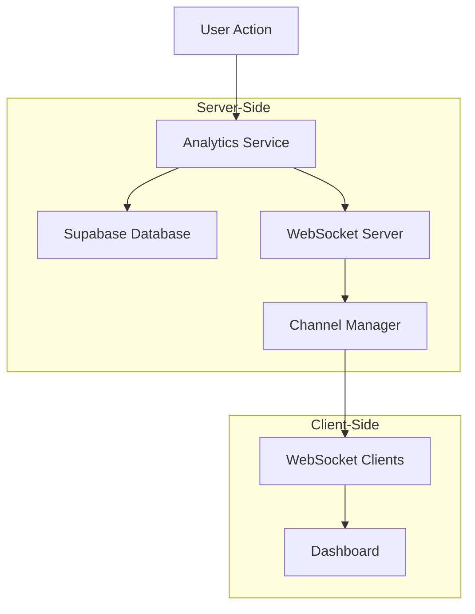

# Real-Time Analytics with WebSockets

This document explains the implementation of real-time analytics using WebSockets in the VowSwap marketplace platform.

## Overview

The real-time analytics system allows the dashboard to receive instant updates when analytics events occur, without requiring page refreshes or periodic polling. This is implemented using WebSockets, which provide a persistent, bidirectional communication channel between the client and server.

## Architecture



## Components

### 1. WebSocket Server (`src/websocket/server.ts`)

The WebSocket server is the core component that manages WebSocket connections and broadcasts analytics events to connected clients. It's implemented as a singleton to ensure a single instance is shared across the application.

Key features:
- Connection management
- Client registration and tracking
- Channel-based broadcasting
- Heartbeat mechanism to keep connections alive
- Reconnection logic for handling disconnections

### 2. Channel Manager (`src/websocket/channels.ts`)

The Channel Manager handles the organization of WebSocket communications into logical channels. Each channel represents a specific type of analytics event or group of events.

Available channels:
- `analytics`: All analytics events
- `analytics:search`: Search-related events
- `analytics:filters`: Filter-related events
- `analytics:listings`: Listing-related events
- `analytics:user_sessions`: User session events

### 3. WebSocket Middleware (`src/websocket/middleware.ts`)

The middleware provides authentication and rate limiting for WebSocket connections:

- Authentication using Supabase JWT tokens
- Rate limiting to prevent abuse
- Subscription management to limit the number of channels a client can subscribe to

### 4. WebSocket Hook (`src/hooks/useWebSocket.ts`)

A custom React hook that simplifies WebSocket usage in React components:

- Connection management
- Automatic reconnection
- Channel subscription
- Message handling

### 5. Analytics Service Integration (`src/services/analyticsService.ts`)

The analytics service has been extended to broadcast events to the WebSocket server when they occur:

```typescript
const broadcastEventsToWebSocket = (events: FilterAnalyticsEvent[]): void => {
  try {
    // Get WebSocket server instance
    const wsServer = WebSocketServer.getInstance();
    
    // Broadcast each event
    events.forEach(event => {
      wsServer.broadcastAnalyticsEvent(event);
    });
  } catch (error) {
    console.error('Error broadcasting events to WebSocket:', error);
  }
};
```

### 6. WebSocket API Route (`src/app/api/websocket/analytics/route.ts`)

A Next.js API route that handles WebSocket connections from clients:

- Upgrades HTTP requests to WebSocket connections
- Authenticates clients
- Handles WebSocket messages
- Manages subscriptions to channels

### 7. Dashboard Integration (`src/app/dashboard/analytics/page.tsx`)

The analytics dashboard has been updated to use WebSockets for real-time updates:

- Connects to the WebSocket server
- Subscribes to relevant channels
- Updates charts and metrics in real-time when events occur
- Provides a toggle to enable/disable real-time updates

## Message Flow

1. A user performs an action (search, filter, view listing, etc.)
2. The action is tracked by the analytics service
3. The analytics service sends the event to Supabase for storage
4. The analytics service broadcasts the event to the WebSocket server
5. The WebSocket server forwards the event to the Channel Manager
6. The Channel Manager sends the event to all clients subscribed to the relevant channel
7. The dashboard receives the event and updates the UI accordingly

## WebSocket Message Format

```typescript
interface WebSocketMessage {
  type: WebSocketEventType; // 'connect', 'disconnect', 'analytics_update', 'error', 'subscribe', 'unsubscribe'
  payload?: any; // The event data
  channel?: string; // The channel the message is for
  timestamp: string; // ISO timestamp
}
```

## Usage

### Subscribing to Analytics Events

```typescript
import { useAnalyticsWebSocket } from '../../../hooks/useWebSocket';
import { ChannelType } from '../../../websocket/channels';

// In your component
const {
  connectionState,
  analyticsEvents,
  subscribe,
  unsubscribe
} = useAnalyticsWebSocket();

// Subscribe to channels
useEffect(() => {
  if (connectionState === 'connected') {
    subscribe(ChannelType.ANALYTICS);
    subscribe(ChannelType.SEARCH);
  }
}, [connectionState, subscribe]);

// Process events
useEffect(() => {
  if (analyticsEvents.length > 0) {
    // Process events and update UI
    // ...
  }
}, [analyticsEvents]);
```

### Handling Real-Time Updates

The dashboard processes real-time events and updates the charts accordingly:

```typescript
// Process real-time analytics events
useEffect(() => {
  if (!realTimeEnabled || analyticsEvents.length === 0) return;

  // Process the events and update the charts
  analyticsEvents.forEach(event => {
    // Update search metrics
    if (event.eventType === 'search' && searchMetrics) {
      // Update popular search terms
      // ...
    }
    
    // Update filter usage metrics
    if (event.eventType === 'filter_apply' && filterUsage) {
      // Update most used filters
      // ...
    }
  });
  
  // Clear processed events
  clearEvents();
}, [analyticsEvents, searchMetrics, filterUsage, clearEvents, realTimeEnabled]);
```

## Security Considerations

1. **Authentication**: WebSocket connections are authenticated using Supabase JWT tokens
2. **Rate Limiting**: Clients are rate-limited to prevent abuse
3. **Channel Access Control**: Clients can only subscribe to channels they have permission to access
4. **Message Validation**: All incoming messages are validated before processing

## Performance Considerations

1. **Batching**: Analytics events are batched before being sent to Supabase to reduce database load
2. **Selective Broadcasting**: Events are only broadcast to clients that have subscribed to the relevant channel
3. **Connection Pooling**: WebSocket connections are pooled to reduce resource usage
4. **Heartbeat**: A heartbeat mechanism keeps connections alive and detects disconnections
5. **Cleanup**: Inactive clients are periodically cleaned up to free resources

## Future Improvements

1. **Scalability**: Implement a more scalable WebSocket architecture using Redis pub/sub or similar
2. **Persistence**: Add support for persisting missed events when clients reconnect
3. **Filtering**: Allow clients to filter events by specific criteria
4. **Aggregation**: Implement server-side aggregation of events to reduce client-side processing
5. **Compression**: Add support for message compression to reduce bandwidth usage
